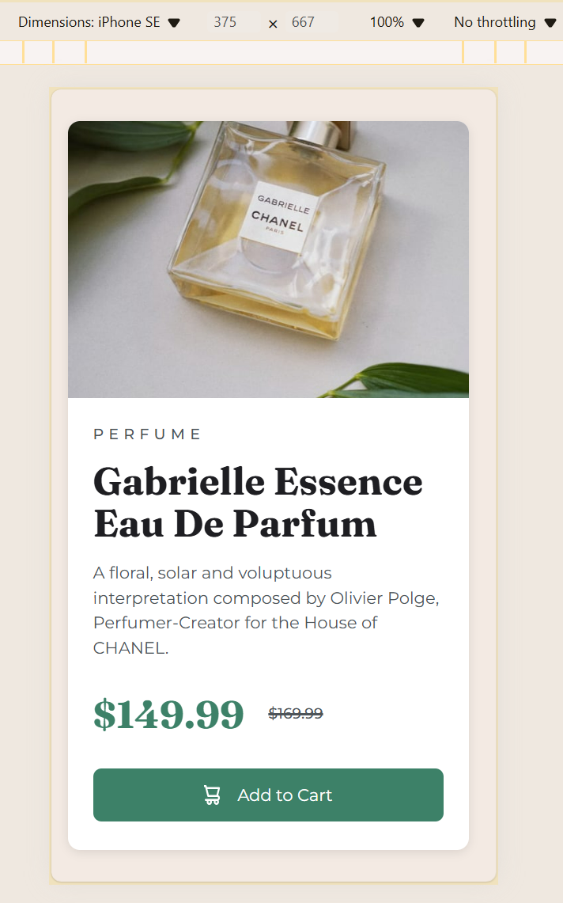

Product preview card, Responsive design (HTML, CSS, media queries)

This is a solution to the [Product preview card component challenge on Frontend Mentor](https://www.frontendmentor.io/challenges/product-preview-card-component-GO7UmttRfa).

## Table of contents

- [Overview](#overview)
  - [The challenge](#the-challenge)
  - [Screenshot](#screenshot)
  - [Links](#links)
- [My process](#my-process)
  - [Built with](#built-with)
  - [What I learned](#what-i-learned)
  - [Continued development](#continued-development)
- [Author](#author)
- [Acknowledgments](#acknowledgments)

## Overview

### The challenge

Users should be able to:

- View the optimal layout depending on their device's screen size
- See hover and focus states for interactive elements

### Screenshot

### Links

- Solution URL: [My solution](https://www.frontendmentor.io/solutions/product-preview-card-responsive-design-html-css-media-queries-hDQnoxkwf-)
- Live Site URL: [My site with page](https://grimm-n.github.io/product-preview-card/)

## My process

### Built with

- Semantic HTML5 markup
- CSS custom properties
- Flexbox
- CSS Grid

### What I learned

I have learned to more effectively adapt websites for mobile versions, ensuring that they look and function well across various screen sizes and devices. This involves optimizing layout and design elements to provide a seamless user experience, regardless of whether users are accessing the site on a smartphone, tablet, or desktop.

### Continued development

I am committed to further enhancing my skills in website adaptation, as this is one of the most crucial areas in web development today. I will continue to refine my techniques to ensure that websites are not only responsive but also provide an optimal user experience across all devices.

## Author

- Frontend Mentor - [@Grimm-N](https://www.frontendmentor.io/profile/Grimm-N)
- Twitter - [@Grimm__N](https://x.com/Grimm__N)
